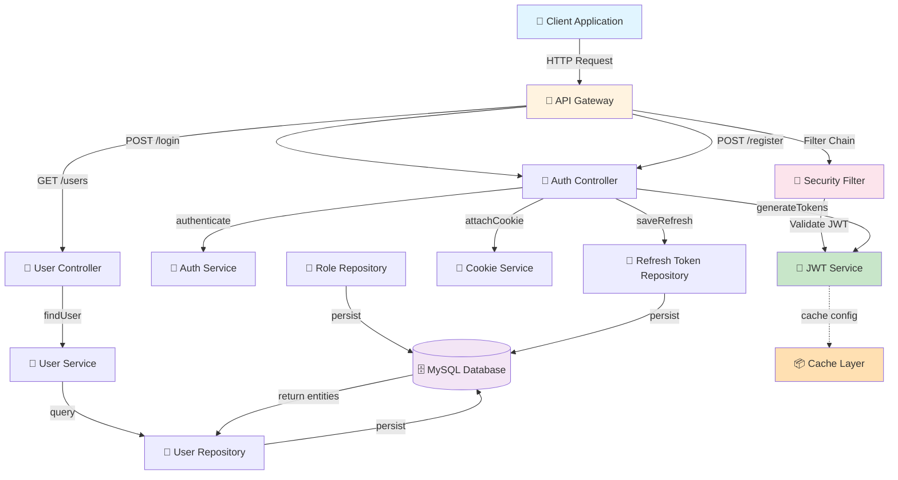
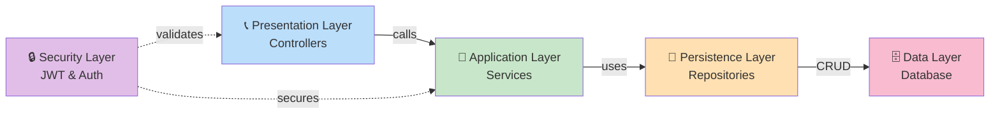
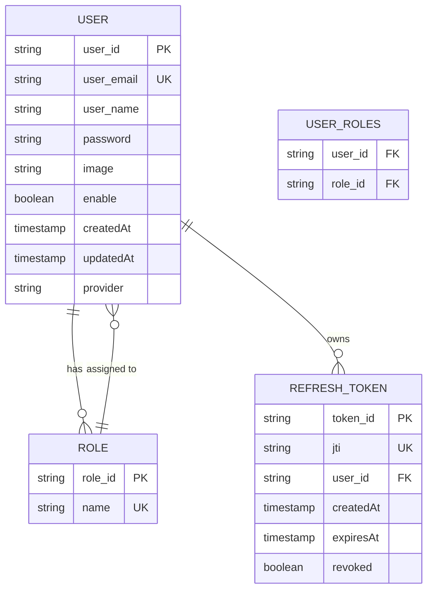
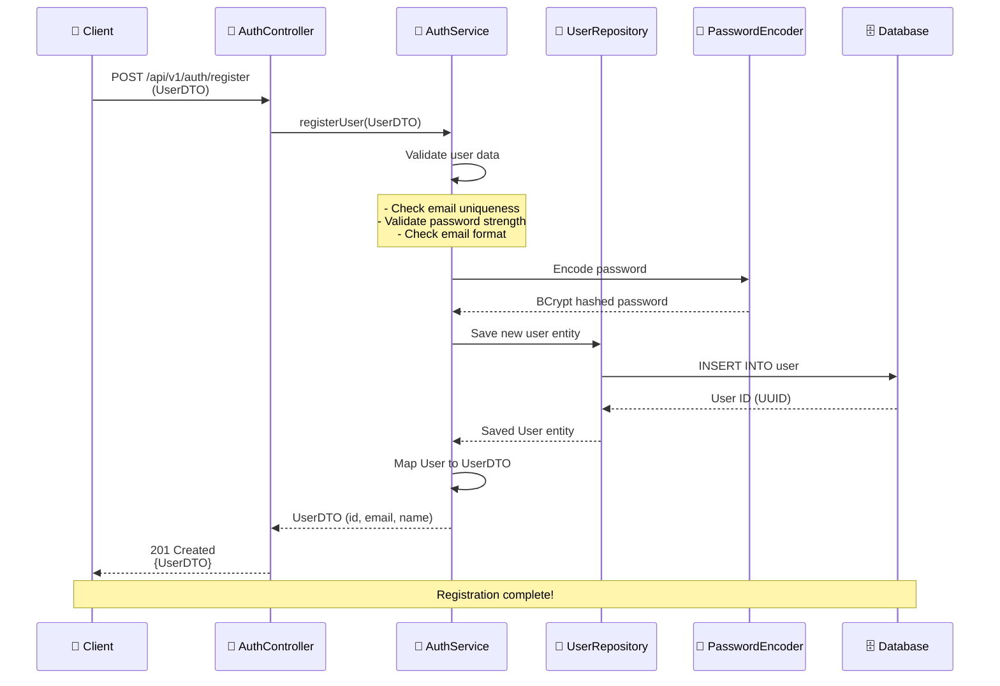
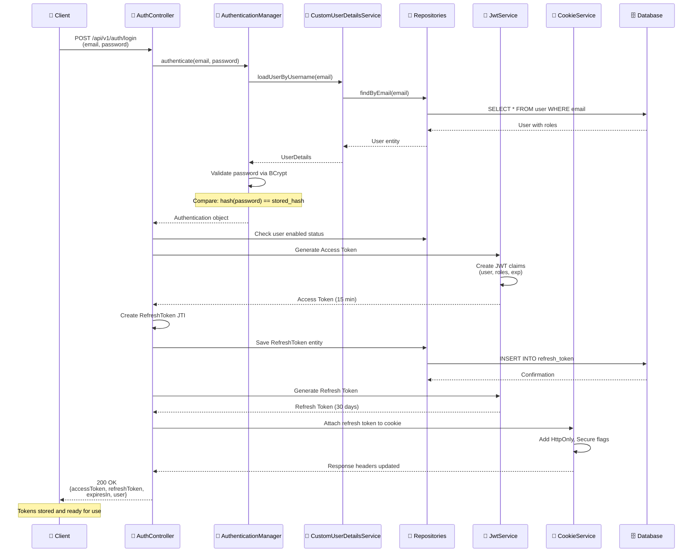
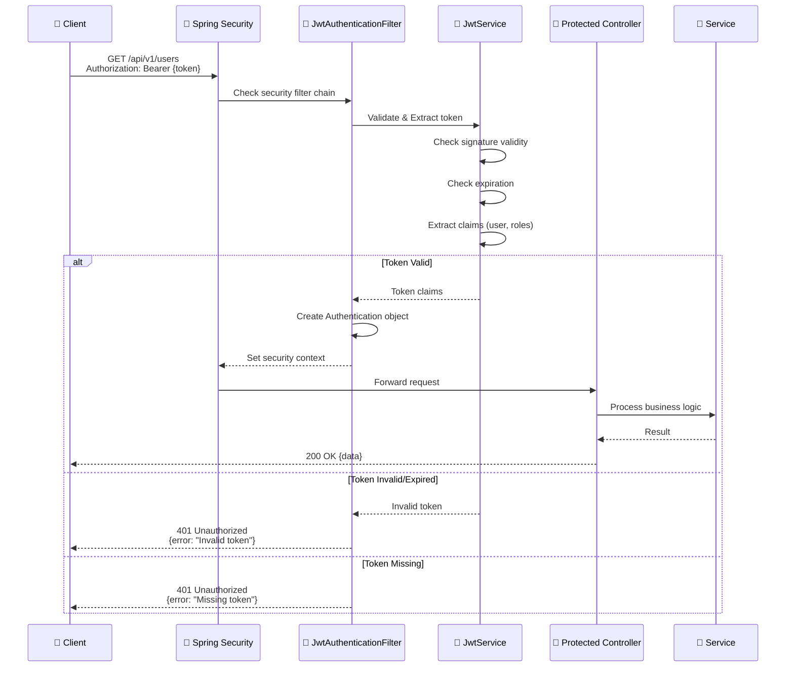
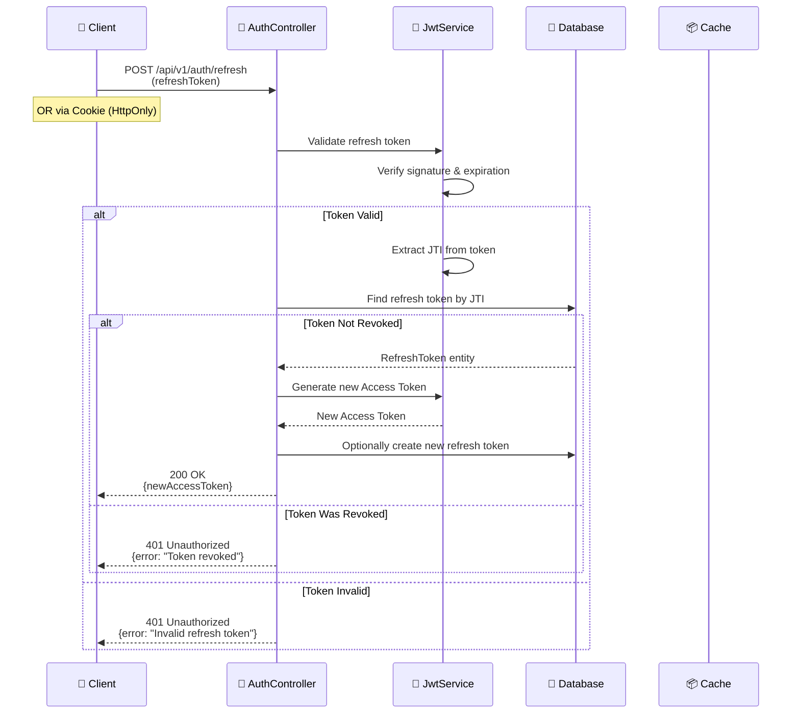
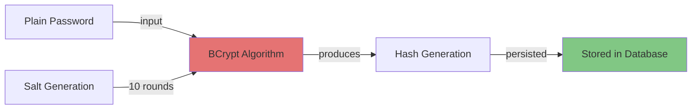
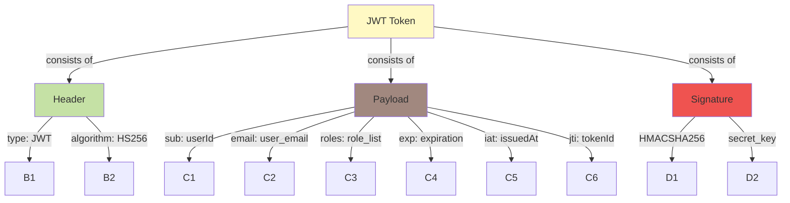
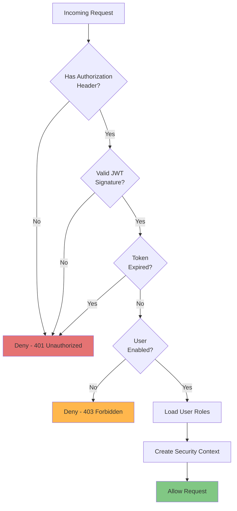

# 🔐 Authentication Application - SRS Documentation

**Version:** 0.0.1  
**Project Name:** auth-app  
**Date:** June 2026  

---

## 📋 Table of Contents

1. [Executive Summary](#executive-summary)
2. [System Overview](#system-overview)
3. [Technology Stack](#technology-stack)
4. [Architecture](#architecture)
5. [Database Design](#database-design)
6. [System Workflows](#system-workflows)
7. [API Specifications](#api-specifications)
8. [Data Models](#data-models)
9. [Security Features](#security-features)
10. [Installation & Setup](#installation--setup)
11. [Deployment](#deployment)
12. [Configuration](#configuration)

---

## 📝 Executive Summary

**Authentication Application** là một ứng dụng cấp phép và xác thực người dùng được xây dựng bằng **Spring Boot 4.0.6**. Ứng dụng cung cấp các tính năng khác nhau:

- ✅ Đăng ký người dùng (User Registration)
- ✅ Đăng nhập (User Login)
- ✅ Quản lý token JWT (Access & Refresh Tokens)
- ✅ Quản lý người dùng (User Management)
- ✅ Hệ thống vai trò (Role-Based Access Control - RBAC)
- ✅ Hỗ trợ nhiều nhà cung cấp (OAuth Providers)
- ✅ Xác thực không trạng thái (Stateless Authentication)

### Mục tiêu chính:
- Cung cấp một hệ thống xác thực an toàn và mạnh mẽ
- Hỗ trợ JWT tokens cho API REST
- Quản lý vai trò và quyền người dùng
- Tích hợp dễ dàng với các ứng dụng khác

---

## 🏗️ System Overview

### Phạm vi dự án:

#### ✅ Bao gồm:
- Đăng ký tài khoản người dùng
- Xác thực bằng email/password
- Phát hành Access Token (15 phút)
- Phát hành Refresh Token (30 ngày)
- Quản lý vai trò người dùng
- Bảo vệ endpoint bằng JWT
- Xử lý lỗi toàn cầu
- Lưu trữ token làm mới trong cơ sở dữ liệu

#### ❌ Không bao gồm:
- OAuth2 Social Login (hiện tại)
- Email verification
- 2FA/MFA
- Password reset flow

---

## 🛠️ Technology Stack

| Layer | Technology | Version |
|-------|-----------|---------|
| **Framework** | Spring Boot | 4.0.6 |
| **Language** | Java | 21 |
| **Security** | Spring Security | 6.x |
| **JPA/ORM** | Spring Data JPA | Latest |
| **JWT** | JJWT | 0.13.0 |
| **Database** | MySQL | 8.0+ |
| **Mapping** | ModelMapper | 3.2.4 |
| **Build Tool** | Maven | 3.8+ |

### Thư viện bổ sung:
- **Lombok** 1.18.30: Giảm boilerplate code
- **Validation**: Spring Validation API
- **Jackson**: JSON serialization

---

## 🏛️ Architecture

### High-Level Architecture Diagram



### Layer Architecture



---

## 🗄️ Database Design

### Entity Relationship Diagram



### Schema SQL

```sql
-- Users Table
CREATE TABLE `user` (
  `user_id` CHAR(36) PRIMARY KEY COMMENT 'UUID',
  `user_email` VARCHAR(300) UNIQUE NOT NULL COMMENT 'Email address',
  `user_name` VARCHAR(500) COMMENT 'Full name',
  `password` VARCHAR(255) NOT NULL COMMENT 'BCrypt hashed password',
  `image` VARCHAR(500) COMMENT 'Avatar URL',
  `enable` BOOLEAN DEFAULT TRUE COMMENT 'Account active status',
  `provider` VARCHAR(50) DEFAULT 'LOCAL' COMMENT 'Auth provider type',
  `created_at` TIMESTAMP DEFAULT CURRENT_TIMESTAMP,
  `updated_at` TIMESTAMP DEFAULT CURRENT_TIMESTAMP ON UPDATE CURRENT_TIMESTAMP,
  INDEX idx_email (`user_email`),
  INDEX idx_provider (`provider`)
) ENGINE=InnoDB DEFAULT CHARSET=utf8mb4 COLLATE=utf8mb4_unicode_ci;

-- Roles Table
CREATE TABLE `role` (
  `role_id` CHAR(36) PRIMARY KEY COMMENT 'UUID',
  `name` VARCHAR(100) UNIQUE NOT NULL COMMENT 'Role name (ADMIN, USER, etc)',
  UNIQUE KEY uk_role_name (`name`)
) ENGINE=InnoDB DEFAULT CHARSET=utf8mb4 COLLATE=utf8mb4_unicode_ci;

-- User Roles Junction Table
CREATE TABLE `user_roles` (
  `user_id` CHAR(36) NOT NULL,
  `role_id` CHAR(36) NOT NULL,
  PRIMARY KEY (`user_id`, `role_id`),
  FOREIGN KEY (`user_id`) REFERENCES `user`(`user_id`) ON DELETE CASCADE,
  FOREIGN KEY (`role_id`) REFERENCES `role`(`role_id`) ON DELETE CASCADE,
  INDEX idx_role_id (`role_id`)
) ENGINE=InnoDB DEFAULT CHARSET=utf8mb4 COLLATE=utf8mb4_unicode_ci;

-- Refresh Tokens Table
CREATE TABLE `refresh_token` (
  `token_id` CHAR(36) PRIMARY KEY COMMENT 'Token ID',
  `jti` VARCHAR(255) UNIQUE NOT NULL COMMENT 'JWT ID',
  `user_id` CHAR(36) NOT NULL,
  `created_at` TIMESTAMP DEFAULT CURRENT_TIMESTAMP,
  `expires_at` TIMESTAMP NOT NULL,
  `revoked` BOOLEAN DEFAULT FALSE COMMENT 'Token revocation status',
  FOREIGN KEY (`user_id`) REFERENCES `user`(`user_id`) ON DELETE CASCADE,
  INDEX idx_user_id (`user_id`),
  INDEX idx_jti (`jti`),
  INDEX idx_expires_at (`expires_at`)
) ENGINE=InnoDB DEFAULT CHARSET=utf8mb4 COLLATE=utf8mb4_unicode_ci;
```

---

## 🔄 System Workflows

### 1️⃣ User Registration Workflow



### 2️⃣ Login & Token Generation Workflow



### 3️⃣ Authorized Request Workflow



### 4️⃣ Token Refresh Workflow



---

## 📡 API Specifications

### Base URL
```
Development:   http://localhost:8082/api/v1
Production:    https://api.auth-app.com/api/v1
```

### Error Response Format
```json
{
  "statusCode": 401,
  "message": "Unauthorized Access",
  "details": "Invalid credentials",
  "path": "/api/v1/users",
  "isError": true
}
```

---

### 1. Authentication Endpoints

#### 1.1 User Registration

```http
POST /auth/register
Content-Type: application/json

{
  "name": "John Doe",
  "email": "john@example.com",
  "password": "SecurePassword@123"
}
```

**Response (201 Created):**
```json
{
  "id": "550e8400-e29b-41d4-a716-446655440000",
  "name": "John Doe",
  "email": "john@example.com",
  "roles": ["USER"]
}
```

**Possible Errors:**
- `400 Bad Request`: Validation failed (invalid email, weak password)
- `409 Conflict`: Email already exists

---

#### 1.2 User Login

```http
POST /auth/login
Content-Type: application/json

{
  "email": "john@example.com",
  "password": "SecurePassword@123"
}
```

**Response (200 OK):**
```json
{
  "accessToken": "eyJhbGciOiJIUzI1NiIsInR5cCI6IkpXVCJ9...",
  "refreshToken": "eyJhbGciOiJIUzI1NiIsInR5cCI6IkpXVCJ9...",
  "expiresIn": 900,
  "user": {
    "id": "550e8400-e29b-41d4-a716-446655440000",
    "name": "John Doe",
    "email": "john@example.com",
    "roles": ["USER"]
  }
}
```

**Cookie Set:**
```
Set-Cookie: refreshToken={token}; HttpOnly; Secure; SameSite=Strict; Max-Age=2592000
```

**Possible Errors:**
- `401 Unauthorized`: Invalid credentials
- `403 Forbidden`: Account disabled
- `404 Not Found`: User not found

---

#### 1.3 Refresh Access Token

```http
POST /auth/refresh
Content-Type: application/json

{
  "refreshToken": "eyJhbGciOiJIUzI1NiIsInR5cCI6IkpXVCJ9..."
}
```

**OR (with HttpOnly Cookie):**
```http
POST /auth/refresh
Cookie: refreshToken=eyJhbGciOiJIUzI1NiIsInR5cCI6IkpXVCJ9...
```

**Response (200 OK):**
```json
{
  "accessToken": "eyJhbGciOiJIUzI1NiIsInR5cCI6IkpXVCJ9...",
  "expiresIn": 900
}
```

**Possible Errors:**
- `401 Unauthorized`: Invalid or expired refresh token
- `401 Unauthorized`: Token has been revoked

---

#### 1.4 Logout

```http
POST /auth/logout
Authorization: Bearer {accessToken}
```

**Response (200 OK):**
```json
{
  "message": "Successfully logged out"
}
```

---

### 2. User Management Endpoints

#### 2.1 Get Current User Profile

```http
GET /users/me
Authorization: Bearer {accessToken}
```

**Response (200 OK):**
```json
{
  "id": "550e8400-e29b-41d4-a716-446655440000",
  "name": "John Doe",
  "email": "john@example.com",
  "image": "https://...",
  "enable": true,
  "provider": "LOCAL",
  "roles": ["USER"],
  "createdAt": "2025-01-15T10:30:00Z",
  "updatedAt": "2025-01-15T10:30:00Z"
}
```

**Possible Errors:**
- `401 Unauthorized`: Missing or invalid token
- `404 Not Found`: User not found

---

#### 2.2 Update User Profile

```http
PUT /users/me
Authorization: Bearer {accessToken}
Content-Type: application/json

{
  "name": "Jane Doe",
  "image": "https://example.com/avatar.jpg"
}
```

**Response (200 OK):**
```json
{
  "id": "550e8400-e29b-41d4-a716-446655440000",
  "name": "Jane Doe",
  "email": "john@example.com",
  "image": "https://example.com/avatar.jpg",
  "updatedAt": "2025-01-15T11:45:00Z"
}
```

---

#### 2.3 Change Password

```http
PUT /users/me/password
Authorization: Bearer {accessToken}
Content-Type: application/json

{
  "oldPassword": "OldPassword@123",
  "newPassword": "NewPassword@456"
}
```

**Response (200 OK):**
```json
{
  "message": "Password changed successfully"
}
```

**Possible Errors:**
- `400 Bad Request`: Weak password
- `401 Unauthorized`: Old password incorrect
- `409 Conflict`: New password same as old

---

#### 2.4 Get All Users (Admin Only)

```http
GET /users?page=0&size=10&sort=createdAt,desc
Authorization: Bearer {adminToken}
```

**Response (200 OK):**
```json
{
  "content": [
    {
      "id": "550e8400-e29b-41d4-a716-446655440000",
      "name": "John Doe",
      "email": "john@example.com",
      "enable": true,
      "createdAt": "2025-01-15T10:30:00Z"
    }
  ],
  "totalElements": 50,
  "totalPages": 5,
  "currentPage": 0
}
```

---

### 3. Role Management Endpoints

#### 3.1 Get All Roles

```http
GET /roles
Authorization: Bearer {token}
```

**Response (200 OK):**
```json
[
  {
    "id": "role-001",
    "name": "ADMIN"
  },
  {
    "id": "role-002",
    "name": "USER"
  },
  {
    "id": "role-003",
    "name": "MODERATOR"
  }
]
```

---

#### 3.2 Assign Role to User (Admin Only)

```http
POST /users/{userId}/roles
Authorization: Bearer {adminToken}
Content-Type: application/json

{
  "roleId": "role-001"
}
```

**Response (200 OK):**
```json
{
  "id": "550e8400-e29b-41d4-a716-446655440000",
  "name": "John Doe",
  "roles": ["ADMIN", "USER"]
}
```

---

## 📊 Data Models

### UserDTO

```json
{
  "id": "550e8400-e29b-41d4-a716-446655440000",
  "name": "string",
  "email": "string",
  "image": "string",
  "enable": "boolean",
  "provider": "LOCAL | GOOGLE | GITHUB | FACEBOOK",
  "roles": ["string"],
  "createdAt": "2025-01-15T10:30:00Z",
  "updatedAt": "2025-01-15T10:30:00Z"
}
```

### LoginRequest

```json
{
  "email": "user@example.com",
  "password": "string"
}
```

### TokenResponse

```json
{
  "accessToken": "string",
  "refreshToken": "string",
  "expiresIn": 900,
  "tokenType": "Bearer",
  "user": "UserDTO"
}
```

### RoleDTO

```json
{
  "id": "string",
  "name": "ADMIN | USER | MODERATOR"
}
```

---

## 🔒 Security Features

### 1. Password Security



**Implementation:**
```
Algorithm: BCrypt
Rounds: 10
Cost Factor: $2a$10$
Password Encoding: UTF-8
```

### 2. JWT Token Structure



**Token Claims:**
```json
{
  "sub": "550e8400-e29b-41d4-a716-446655440000",
  "email": "john@example.com",
  "roles": ["USER"],
  "exp": 1705318200,
  "iat": 1705317300,
  "jti": "a1b2c3d4-e5f6-47g8-h9i0-j1k2l3m4n5o6"
}
```

| Field | Type | TTL | Purpose |
|-------|------|-----|---------|
| Access Token | JWT | 15 minutes | API requests |
| Refresh Token | JWT | 30 days | Get new access token |

### 3. Request Authorization Flow



### 4. Security Headers

| Header | Value | Purpose |
|--------|-------|---------|
| Content-Security-Policy | default-src 'self' | XSS Protection |
| X-Frame-Options | DENY | Clickjacking Protection |
| X-Content-Type-Options | nosniff | MIME Sniffing |
| Strict-Transport-Security | max-age=31536000 | HTTPS Enforcement |
| HttpOnly Cookie | refreshToken | XSS Token Protection |

### 5. CORS Configuration

```
Allowed Origins: http://localhost:3000, https://example.com
Allowed Methods: GET, POST, PUT, DELETE, OPTIONS
Allowed Headers: Content-Type, Authorization
Credentials: true
Max Age: 3600 seconds
```

---

## 💻 Installation & Setup

### Prerequisites

```
✓ Java 21 or higher
✓ Maven 3.8+
✓ MySQL 8.0+
✓ Git
```

### Step 1: Clone Repository

```bash
git clone https://github.com/yourusername/auth-app.git
cd auth-app
```

### Step 2: Configure Database

```bash
# Create database
mysql -u root -p << EOF
CREATE DATABASE auth_app;
CREATE DATABASE auth_app_test;
EOF
```

### Step 3: Environment Configuration

**Create `application-dev.yml`:**
```yaml
spring:
  datasource:
    url: jdbc:mysql://localhost:3306/auth_app
    username: root
    password: your_password
    driver-class-name: com.mysql.cj.jdbc.Driver
    
  jpa:
    hibernate:
      ddl-auto: validate
    properties:
      hibernate:
        dialect: org.hibernate.dialect.MySQL8Dialect
        format_sql: true
    show-sql: true
    
  security:
    jwt:
      secret: your-super-secret-key-min-32-chars-long!!!
      access-ttl: 900 # 15 minutes
      refresh-ttl: 2592000 # 30 days
      
  servlet:
    multipart:
      max-file-size: 10MB
      max-request-size: 10MB

logging:
  level:
    root: INFO
    com.tamdao.auth: DEBUG
```

### Step 4: Install Dependencies

```bash
mvn clean install
```

### Step 5: Run Application

```bash
# Development mode
mvn spring-boot:run -Dspring-boot.run.arguments="--spring.profiles.active=dev"

# Or using JAR
java -jar target/auth-app-0.0.1-SNAPSHOT.jar --spring.profiles.active=dev
```

### Step 6: Verify Installation

```bash
# Check API is running
curl http://localhost:8082/api/v1/auth/login

# Response should be:
# {"statusCode":400, "message":"Bad Request"}
```

---

## 🚀 Deployment

### Build Docker Image

```dockerfile
# Dockerfile
FROM openjdk:21-jdk-slim

WORKDIR /app

COPY target/auth-app-0.0.1-SNAPSHOT.jar app.jar

EXPOSE 8082

ENTRYPOINT ["java", "-jar", "app.jar"]
```

```bash
docker build -t auth-app:0.0.1 .
docker run -e SPRING_PROFILES_ACTIVE=prod --name auth-app auth-app:0.0.1
```

### Docker Compose Setup

```yaml
version: '3.8'

services:
  mysql:
    image: mysql:8.0
    environment:
      MYSQL_ROOT_PASSWORD: root_password
      MYSQL_DATABASE: auth_app
    ports:
      - "3306:3306"
    volumes:
      - mysql_data:/var/lib/mysql
    healthcheck:
      test: ["CMD", "mysqladmin", "ping", "-h", "localhost"]
      interval: 10s
      timeout: 5s
      retries: 5

  auth-app:
    build:
      context: .
      dockerfile: Dockerfile
    environment:
      SPRING_DATASOURCE_URL: jdbc:mysql://mysql:3306/auth_app
      SPRING_DATASOURCE_USERNAME: root
      SPRING_DATASOURCE_PASSWORD: root_password
      SPRING_PROFILES_ACTIVE: prod
    ports:
      - "8082:8082"
    depends_on:
      mysql:
        condition: service_healthy

volumes:
  mysql_data:
```

---

## ⚙️ Configuration

### Environment Profiles

#### Development (`application-dev.yml`)
```yaml
spring:
  profiles:
    active: dev
  jpa:
    hibernate:
      ddl-auto: create-drop
    show-sql: true
```

#### QA (`application-qa.yml`)
```yaml
spring:
  profiles:
    active: qa
  jpa:
    hibernate:
      ddl-auto: validate
    show-sql: false
```

#### Production (`application-prod.yml`)
```yaml
spring:
  profiles:
    active: prod
  jpa:
    hibernate:
      ddl-auto: validate
    show-sql: false
  datasource:
    hikari:
      maximum-pool-size: 20
      minimum-idle: 5
```

### JWT Configuration

**Properties:**
```properties
JWT_SECRET=your-secret-key-minimum-32-characters-required!!!
JWT_ACCESS_TTL=900
JWT_REFRESH_TTL=2592000
JWT_ALGORITHM=HS256
```

### Security Configuration

**Key Features:**
- ✅ CSRF disabled (Stateless API)
- ✅ CORS enabled
- ✅ Stateless sessions
- ✅ JWT filter chain
- ✅ Global exception handling

---

## 🧪 Testing

### Running Tests

```bash
# Run all tests
mvn test

# Run specific test class
mvn test -Dtest=AuthControllerTest

# Run with coverage
mvn clean test jacoco:report
```

### Test Coverage

```
Unit Tests: Service, Repository
Integration Tests: Controller, Security
Coverage Target: > 80%
```

---

## 📦 Project Structure

```
auth-app/
├── src/
│   ├── main/
│   │   ├── java/com/tamdao/auth/auth_app/
│   │   │   ├── config/
│   │   │   │   ├── ProjectConfig.java
│   │   │   │   └── SecurityConfig.java
│   │   │   ├── controller/
│   │   │   │   ├── AuthController.java
│   │   │   │   └── UserController.java
│   │   │   ├── dto/
│   │   │   │   ├── LoginRequest.java
│   │   │   │   ├── TokenResponse.java
│   │   │   │   ├── UserDTO.java
│   │   │   │   └── RoleDTO.java
│   │   │   ├── entity/
│   │   │   │   ├── User.java
│   │   │   │   ├── Role.java
│   │   │   │   ├── RefreshToken.java
│   │   │   │   └── Provider.java
│   │   │   ├── exception/
│   │   │   │   ├── GlobalExceptionHandler.java
│   │   │   │   └── ResourceNotFoundException.java
│   │   │   ├── helpers/
│   │   │   │   └── UserHelper.java
│   │   │   ├── repository/
│   │   │   │   ├── UserRepository.java
│   │   │   │   ├── RoleRepository.java
│   │   │   │   └── RefreshTokenRepository.java
│   │   │   ├── security/
│   │   │   │   ├── JwtService.java
│   │   │   │   ├── JwtAuthenticationFilter.java
│   │   │   │   ├── CustomUserDetailService.java
│   │   │   │   └── CookieService.java
│   │   │   ├── service/
│   │   │   │   ├── AuthService.java
│   │   │   │   ├── UserService.java
│   │   │   │   └── impl/
│   │   │   │       ├── AuthServiceImpl.java
│   │   │   │       └── UserServiceImpl.java
│   │   │   └── AuthAppApplication.java
│   │   └── resources/
│   │       ├── application.yaml
│   │       ├── application-dev.yml
│   │       ├── application-qa.yml
│   │       ├── application-prod.yml
│   │       └── static/
│   └── test/
│       └── java/com/tamdao/auth/auth_app/
│           └── AuthAppApplicationTests.java
├── pom.xml
├── README.md
└── docker-compose.yml
```

---

## 📋 Component Responsibilities

### Controllers
- Receive HTTP requests
- Validate input parameters
- Call service layer
- Return HTTP responses with appropriate status codes

### Services
- Business logic implementation
- Data validation
- Transaction management
- Cross-service communication

### Repositories
- Database access operations (CRUD)
- Custom query methods
- Data persistence

### Security
- JWT token generation & validation
- User authentication
- Role-based authorization
- Cookie management

### DTOs
- Data transfer between layers
- Validation annotations
- Request/Response serialization

---

## 🔧 Common Troubleshooting

| Issue | Solution |
|-------|----------|
| `Connection refused to MySQL` | Ensure MySQL is running on port 3306 |
| `Invalid JWT token` | Check JWT_SECRET is correctly set |
| `401 Unauthorized on all requests` | Verify token format: `Bearer {token}` |
| `User not found` | Ensure user email exists in database |
| `Password mismatch` | Check if password is BCrypt hashed |
| `Token expired` | Use refresh token to get new access token |

---

## 📚 Additional Resources

- [Spring Boot Documentation](https://spring.io/projects/spring-boot)
- [Spring Security](https://spring.io/projects/spring-security)
- [JWT RFC 7519](https://tools.ietf.org/html/rfc7519)
- [OWASP Authentication](https://owasp.org/www-project-authentication-cheat-sheet/)

---

## 📞 Support & Contact

**Project Maintainer:** TamDAO  
**Email:** tam@example.com  
**Issues:** https://github.com/yourusername/auth-app/issues  

---

## 📄 License

This project is licensed under the MIT License - see the LICENSE file for details.

---

## 🎯 Roadmap

- [x] Basic authentication (Email/Password)
- [x] JWT token management
- [x] Role-based access control
- [ ] OAuth2 / Social login
- [ ] Email verification
- [ ] 2FA/MFA support
- [ ] Password reset flow
- [ ] Advanced audit logging
- [ ] Rate limiting
- [ ] API versioning

---

**Last Updated:** June 2026  
**Version:** 0.0.1-SNAPSHOT

---


